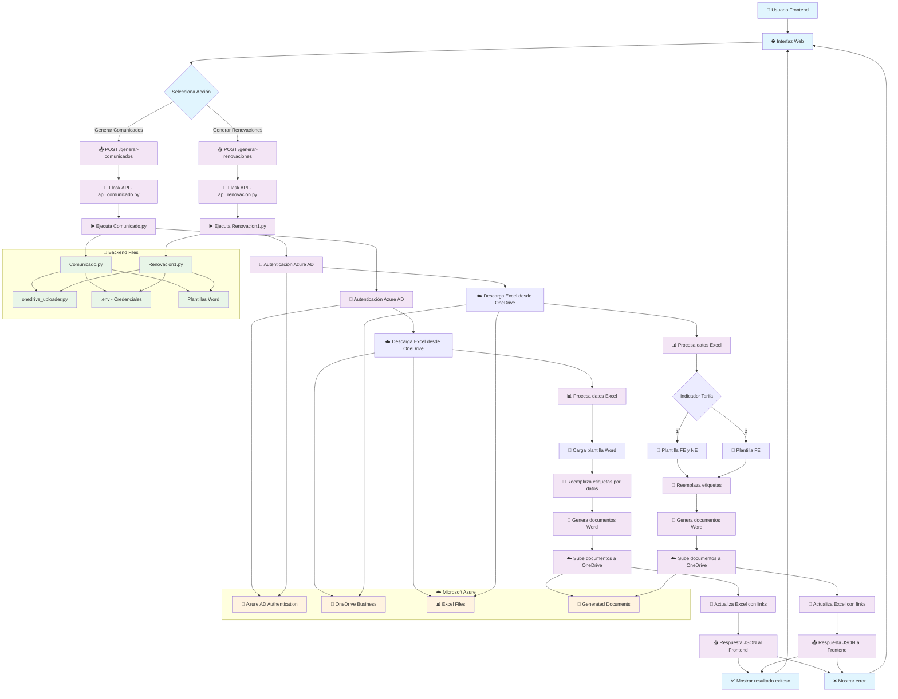

# Diagrama de Flujo - Sistema de Generación de Documentos

## Flujo Detallado por Componente

### 1. **Frontend (Interfaz Web)**
- Usuario selecciona generar comunicados o renovaciones
- Envía petición HTTP POST al backend
- Recibe respuesta JSON con resultado

### 2. **Backend API (Flask)**
- `api_comunicado.py` - Endpoint para comunicados
- `api_renovacion.py` - Endpoint para renovaciones
- Ejecuta scripts Python correspondientes
- Retorna resultado al frontend

### 3. **Scripts de Procesamiento**
- `Comunicado.py` - Genera comunicados
- `Renovacion1.py` - Genera renovaciones
- Ambos siguen el mismo patrón:
  1. Autenticación con Azure AD
  2. Descarga Excel desde OneDrive
  3. Procesa datos
  4. Genera documentos Word
  5. Sube a OneDrive
  6. Actualiza Excel con links

### 4. **Servicios Azure**
- **Azure AD**: Autenticación y autorización
- **OneDrive Business**: Almacenamiento de archivos
- **Microsoft Graph API**: Acceso a servicios

### 5. **Archivos de Configuración**
- `.env` - Credenciales Azure
- `onedrive_uploader.py` - Utilidad para subir archivos
- Plantillas Word - Templates para documentos

## Tecnologías Utilizadas
- **Frontend**: HTML/CSS/JavaScript
- **Backend**: Python + Flask
- **Procesamiento**: pandas, python-docx, msal
- **Cloud**: Microsoft Azure (AD + OneDrive)
- **Autenticación**: OAuth 2.0 con Azure AD