# Diagrama de Flujo - Sistema de Generación de Documentos

```mermaid
flowchart TD
    %% Frontend
    A[👤 Usuario Frontend] --> B[🌐 Interfaz Web]
    B --> C{Selecciona Acción}
    
    C -->|Generar Comunicados| D[📤 POST /generar-comunicados]
    C -->|Generar Renovaciones| E[📤 POST /generar-renovaciones]
    
    %% Backend API
    D --> F[🔧 Flask API - api_comunicado.py]
    E --> G[🔧 Flask API - api_renovacion.py]
    
    F --> H[▶️ Ejecuta Comunicado.py]
    G --> I[▶️ Ejecuta Renovacion1.py]
    
    %% Proceso de Comunicados
    H --> J[🔐 Autenticación Azure AD]
    J --> K[☁️ Descarga Excel desde OneDrive]
    K --> L[📊 Procesa datos Excel]
    L --> M[📄 Carga plantilla Word]
    M --> N[🔄 Reemplaza etiquetas por datos]
    N --> O[💾 Genera documentos Word]
    O --> P[☁️ Sube documentos a OneDrive]
    P --> Q[🔗 Actualiza Excel con links]
    Q --> R[📤 Respuesta JSON al Frontend]
    
    %% Proceso de Renovaciones
    I --> S[🔐 Autenticación Azure AD]
    S --> T[☁️ Descarga Excel desde OneDrive]
    T --> U[📊 Procesa datos Excel]
    U --> V{Indicador Tarifa}
    V -->|1| W[📄 Plantilla FE y NE]
    V -->|2| X[📄 Plantilla FE]
    W --> Y[🔄 Reemplaza etiquetas]
    X --> Y
    Y --> Z[💾 Genera documentos Word]
    Z --> AA[☁️ Sube documentos a OneDrive]
    AA --> BB[🔗 Actualiza Excel con links]
    BB --> CC[📤 Respuesta JSON al Frontend]
    
    %% Servicios Externos
    subgraph "☁️ Microsoft Azure"
        DD[🔑 Azure AD Authentication]
        EE[📁 OneDrive Business]
        FF[📊 Excel Files]
        GG[📄 Generated Documents]
    end
    
    J --> DD
    S --> DD
    K --> EE
    T --> EE
    K --> FF
    T --> FF
    P --> GG
    AA --> GG
    
    %% Archivos del Sistema
    subgraph "📁 Backend Files"
        HH[Comunicado.py]
        II[Renovacion1.py]
        JJ[onedrive_uploader.py]
        KK[.env - Credenciales]
        LL[Plantillas Word]
    end
    
    H --> HH
    I --> II
    HH --> JJ
    II --> JJ
    HH --> KK
    II --> KK
    HH --> LL
    II --> LL
    
    %% Respuestas al Frontend
    R --> MM[✅ Mostrar resultado exitoso]
    CC --> MM
    R --> NN[❌ Mostrar error]
    CC --> NN
    
    MM --> B
    NN --> B

    %% Estilos
    classDef frontend fill:#e1f5fe
    classDef backend fill:#f3e5f5
    classDef azure fill:#fff3e0
    classDef files fill:#e8f5e8
    
    class A,B,C,MM,NN frontend
    class D,E,F,G,H,I,J,S,L,U,N,Y,O,Z,P,AA,Q,BB,R,CC backend
    class DD,EE,FF,GG azure
    class HH,II,JJ,KK,LL files
```

## Flujo Detallado por Componente

### 1. **Frontend (Interfaz Web)**
- Usuario selecciona generar comunicados o renovaciones
- Envía petición HTTP POST al backend
- Recibe respuesta JSON con resultado

### 2. **Backend API (Flask)**
- `api_comunicado.py` - Endpoint para comunicados
- `api_renovacion.py` - Endpoint para renovaciones
- Ejecuta scripts Python correspondientes
- Retorna resultado al frontend

### 3. **Scripts de Procesamiento**
- `Comunicado.py` - Genera comunicados
- `Renovacion1.py` - Genera renovaciones
- Ambos siguen el mismo patrón:
  1. Autenticación con Azure AD
  2. Descarga Excel desde OneDrive
  3. Procesa datos
  4. Genera documentos Word
  5. Sube a OneDrive
  6. Actualiza Excel con links

### 4. **Servicios Azure**
- **Azure AD**: Autenticación y autorización
- **OneDrive Business**: Almacenamiento de archivos
- **Microsoft Graph API**: Acceso a servicios

### 5. **Archivos de Configuración**
- `.env` - Credenciales Azure
- `onedrive_uploader.py` - Utilidad para subir archivos
- Plantillas Word - Templates para documentos

## Tecnologías Utilizadas
- **Frontend**: HTML/CSS/JavaScript
- **Backend**: Python + Flask
- **Procesamiento**: pandas, python-docx, msal
- **Cloud**: Microsoft Azure (AD + OneDrive)
- **Autenticación**: OAuth 2.0 con Azure AD